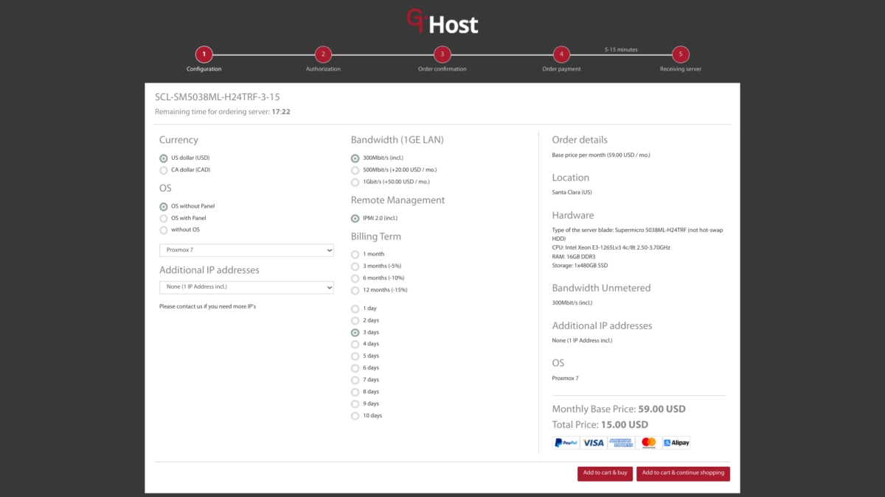
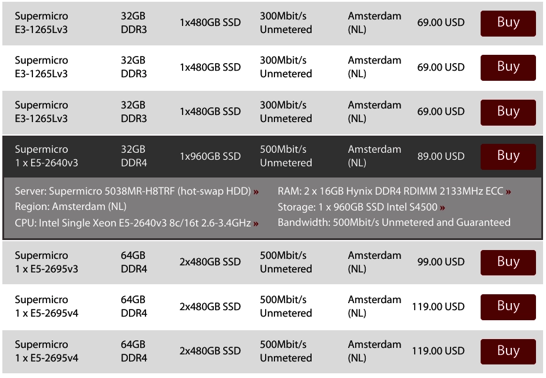
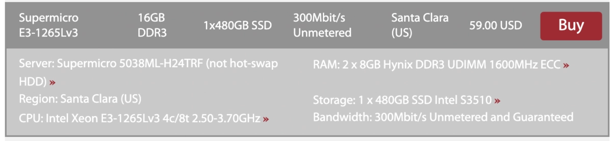
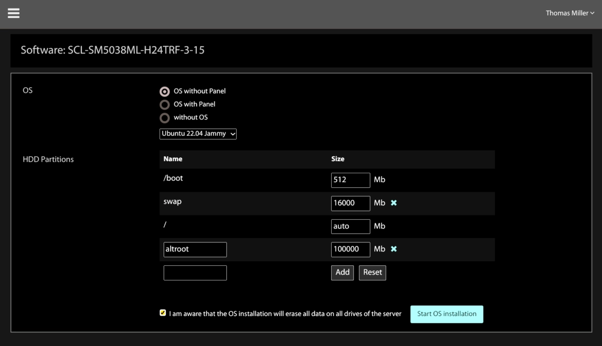

# GTHost服务器真实测评：17个机房，15分钟交付靠谱吗?

最近手头有个项目需要快速部署，看到GTHost宣传的"15分钟交付"有点心动。作为一个折腾了几年服务器的人，我知道这种承诺往往水分很大——但这次，GTHost确实让我有点意外。

花了几天时间，我在他们不同机房测了好几台服务器。有些体验确实不错，有些细节还挺坑。今天就把这些真实感受分享出来，看看GTHost到底值不值得入手。

---

## GTHost的卖点，哪些是真的？

先列一下他们官网挂出来的那些特性：

**机房和网络**
- 17个机房分布在美国、加拿大、荷兰、德国、英国、法国
- 100GE网络基础设施（Juniper设备）
- 保证带宽300Mbps到10Gbps（注意是"保证"，不是"峰值"）

**服务器配置**
- 独立服务器起步价59美元/月
- 购买前能看到完整的硬件规格
- 真的是15分钟内交付（7×24小时）
- 没有安装费

**其他功能**
- 短期试用：5美元/天起，可以试1-10天
- 实时显示可用服务器列表
- 可以按机房、处理器、价格筛选1G/10G/存储服务器
- 提供IPMI
- 可申请额外IPv4和/64 IPv6
- 每个机房都有Looking Glass

说实话，能提供短期试用且不收安装费的独服商家真不多。而且"保证带宽"这个说法也挺少见——大多数商家都是玩文字游戏，写个"up to"就完事了。

## 第一台测试机：Santa Clara的E3-1265L v3

### 选机器的过程

既然是测评，当然先从最便宜的开始。我选了GTHost促销页上最便宜的配置：
- CPU：E3-1265L v3
- 内存：16GB
- 硬盘：1×480GB SSD
- 带宽：300Mbps
- 价格：59美元/月

为什么选Santa Clara？因为我在Sonora，ping了一下他们的Looking Glass，延迟还可以：

```
64 bytes from 167.88.60.166: icmp_seq=1 ttl=53 time=22.0 ms
64 bytes from 167.88.60.166: icmp_seq=2 ttl=53 time=18.9 ms
```

### 安装过程的坑

点进去实时服务器列表，找到这台E3-1265L v3，点"Buy"进入配置界面。这个界面给你大概半小时时间选操作系统、租期等等。我选了Proxmox，租期3天。

**第一个坑来了：** 我以为后面会有机会加第二块硬盘，结果没有。原来硬盘数量必须在最开始的列表里就选好——这对快速部署来说是合理的，但我当时没注意。后来回去看，Santa Clara确实没有双盘的E3-1265L v3，其他机房有，价格是69美元/月。多一块硬盘做RAID 1，贵10美元。

**第二个细节：** 我本来想分一个/altroot分区出来（用来装debootstrap、Linux from Scratch这些玩意儿）。发现有些操作系统的安装界面似乎支持自定义分区，有些又不行。我猜可能是DOS分区表支持，GUID分区表不支持？

**第三个发现：** 额外IPv4地址看起来是2美元/月/个，但我选的这个组合在配置界面里没法直接加，需要提工单。IPv6的/64也得提工单。

安装完成后，控制面板显示25号端口被屏蔽了。意思是Proxmox没法发邮件通知，除非开通25端口。👉 [想要稳定的独立服务器？看看GTHost在17个机房的选择](https://cp.gthost.com/en/join/72c7e6b2fc118929f9ede2978f008806)——后来GTHost告诉我，月付服务器会自动解封25端口。



从截图可以看到，升级到500Mbps要加20美元/月，升级到1Gbps要加50美元/月。所以如果我要双硬盘+1Gbps的配置，E3-1265L v3就要119美元/月了。不过测试嘛，就用最基础的59美元版本。

### 15分钟交付？有点复杂

这个问题其实挺有意思的😄

**Proxmox的情况：** 从我点"加入购物车"到收到登录邮件，手机计时器显示24分33秒。但Proxmox安装其实是两步：先装Debian，再在上面装Proxmox（带Ubuntu内核）。如果算两次安装，是不是可以说每个12分钟？😄

**更搞笑的是：** 我收到邮件后立刻SSH登录，服务器显示uptime只有8分钟。那是不是应该从24分钟里减掉这8分钟？😄

```
root@XXX.XXX.197.169:~# w
23:07:49 up 8 min, 1 user, load average: 0.01, 0.03, 0.00
```

**还有个细节：** 点"加入购物车"后还有一个页面，让你选支付方式、确认服务条款。我之前读过条款了，这页只停留了大概1分钟。这1分钟也应该减掉吧？😄

这么一算，24分钟减掉8分钟uptime，再减掉1分钟确认页面，差不多就是15分钟了。而且邮件通知也需要时间，这个可以再宽限1-2分钟……

**好消息是：** 后面测试Ubuntu的时候，确实只用了8分16秒！所以15分钟这个承诺，对于大多数操作系统来说是成立的。

### 硬件规格：意外的惊喜

服务器装好后，控制面板显示内存是ECC的。我之前看服务器列表时没注意到这个信息。用dmidecode确认了一下，确实是ECC：

```
root@XXX.XXX.197.169:~# dmidecode -t memory | grep "72"
Total Width: 72 bits
Total Width: 72 bits
```

后来GTHost告诉我，其实每台服务器的列表是可以展开的，展开后能看到完整硬件规格！我完全错过了这个功能😅



这是Amsterdam一台服务器的展开规格。可以看到非常详细的信息，包括主板型号、内存类型、硬盘品牌等等。



而且每个组件还能点进去看更详细的信息。用GTHost自己的话说："我们展示每台服务器的完整规格，客户能清楚知道自己买的是什么。"

### Proxmox实测性能

睡了一觉起来，跑了个Yabs测试：

**基本信息：**
- 处理器：Intel Xeon E3-1265L v3 @ 2.50GHz（2013年第二季度发布）
- 核心数：8核 @ 3700MHz
- 内存：15.6GB
- 硬盘：437.1GB

**硬盘速度：**
- 4k读写：253.41 MB/s（63.3k IOPS）
- 1m读写：452.75 MB/s（441 IOPS）

**网络速度（IPv4）：**
- 伦敦：收246 Mbps
- 巴黎：发256 Mbps
- 纽约：收280 Mbps
- 达拉斯：收227 Mbps
- 洛杉矶：发288 Mbps / 收287 Mbps

**Geekbench 5：**
- 单核：992
- 多核：3405

考虑到这是2013年的处理器，单核能接近1000分还是挺不错的。

### 网络情况

跑whois查了一下IP：

```
NetRange:       169.197.140.0 - 169.197.143.255
NetName:        AS-GLOBALTELEHOST
OriginAS:       AS62563
Organization:   GLOBALTELEHOST Corp.
```

从Hurricane Electric的BGP信息看，GTHost（AS63023）和GTT Communications、Cogent、HE自己都有对等连接。

条款页面用的是GlobalTeleHost Corp.这个名字，但具体公司结构不太清楚，官网上也没找到公司注册信息链接。后来GTHost告诉我，他们不是GTT Communications, Inc.的一部分。

### 重装Ubuntu：真快

GTHost让我试试重装，说Proxmox是最慢的系统。我重装了Ubuntu 22.04 Jammy，这次只用了**8分16秒**！



而且这次我终于搞到/altroot分区了！

### Installimage：熟悉的配方

重装完Ubuntu后，我在根目录发现了`installimage.conf`和`installimage.debug`。这玩意儿用过Hetzner的人都很熟悉——原来GTHost用的是Installimage！

```
root@scl-sm5038ml-h24trf-3-15:~# cat /installimage.conf
#
# GlobalTeleHost Corp. - installimage
#

HOSTNAME scl-sm5038ml-h24trf-3-15.gthost.com
IMAGE_PATH http://167.88.61.254/ks/osimage/Ubuntu-2204-jammy-64-minimal.gth.tar.gz
BOOTLOADER grub
SWRAID 0
DRIVE1 /dev/sda
PART /boot ext3 512
PART swap swap 16000
PART /altroot ext4 100000
PART / ext4 all
```

Installimage有自由许可证，很高兴看到它在Hetzner之外被使用。

### Ubuntu性能测试

跑了一遍Yabs，结果和Proxmox差不多：

**Geekbench 5：**
- 单核：983
- 多核：3421

**网络速度：**
整体和Proxmox测试结果接近，大部分欧美节点都能跑满或接近300Mbps。

### 服务器到期

测试服务器到期后，会被直接删除。我没收到续费提醒邮件，只收到一封"你的服务器和所有数据已被删除"的通知。

所以友情提示：**如果试用GTHost的短期服务器，一定要及时备份重要数据！**

## 第二台服务器：芝加哥的E5-2678 v3

GTHost让我试试同时测几台不同操作系统的服务器，我也想试试IPMI功能。

这次选了芝加哥的：
- CPU：Xeon E5-2678 v3
- 内存：32GB
- 硬盘：2×800GB SSD
- 带宽：500Mbps
- 价格：124美元/月

正好卡在LowEndTalk允许发帖的125美元上限以下😄

Ubuntu 22.04的安装用了11分25秒。关于这台服务器和IPMI的更多细节，会在后续文章里讲。

## 目前的整体感受

### 优点

**机房位置好：** 第一台测试机离我很近，所有操作都非常流畅！17个机房确实是个优势，总有一个离你近。

**界面友好：** 官网和控制面板都很清晰易用，功能都能正常工作，没遇到什么bug。

**长期稳定感：** 整个使用过程给人一种"这个服务会长期稳定运行"的感觉。

### 关于价格

我们的第一台测试机基础价是59美元/月。如果要加第二块硬盘做RAID 1，再升级到1Gbps带宽，E3-1265L v3配置就要119美元/月了。

为了对比，我去看了IBM的SoftLayer（现在叫IBM Cloud），他们默认的裸机服务器配置："预计总成本3,338.60美元/月"。

和SoftLayer比，GTHost的价格毫无疑问属于Low End范畴。

---

**想尝鲜？** GTHost的[当前促销页面](https://gthost.com/promotions/)有更多便宜配置。他们还提供了一个促销码：**LET22-30**，首月8折，有效期到2022年8月31日。适用于任何GTHost服务器。

总的来说，如果你需要快速部署、机房选择多、价格合理的独立服务器，GTHost值得一试。只是记得，短期试用要及时备份数据。👉 [在17个机房中找到最适合你的服务器](https://cp.gthost.com/en/join/72c7e6b2fc118929f9ede2978f008806)，部署快、价格实在，适合各种场景。
